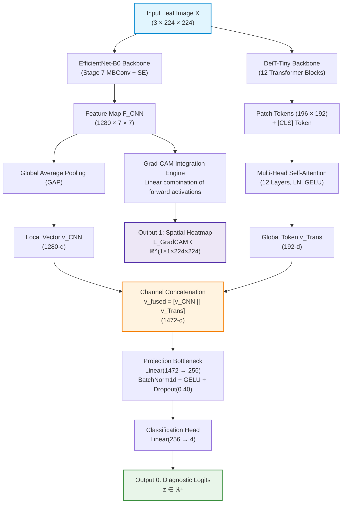
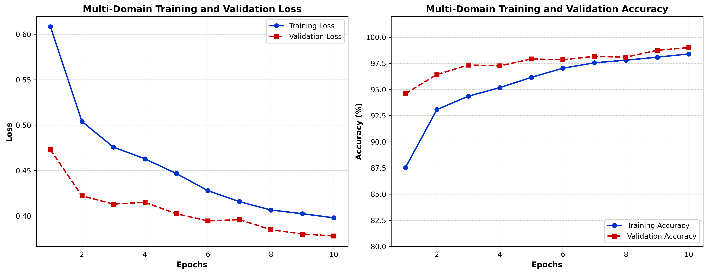
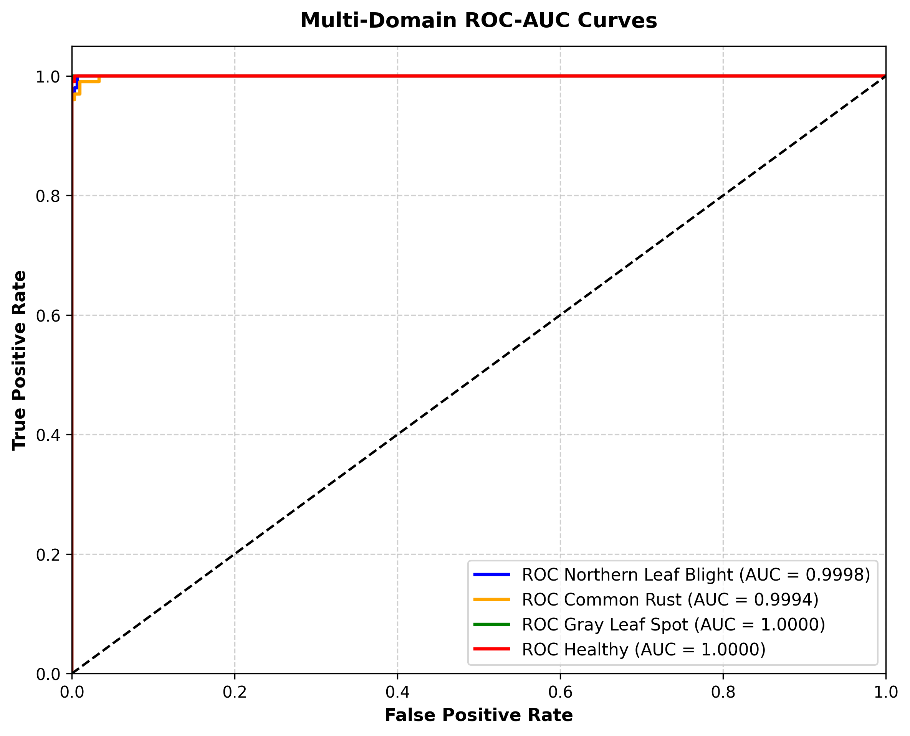
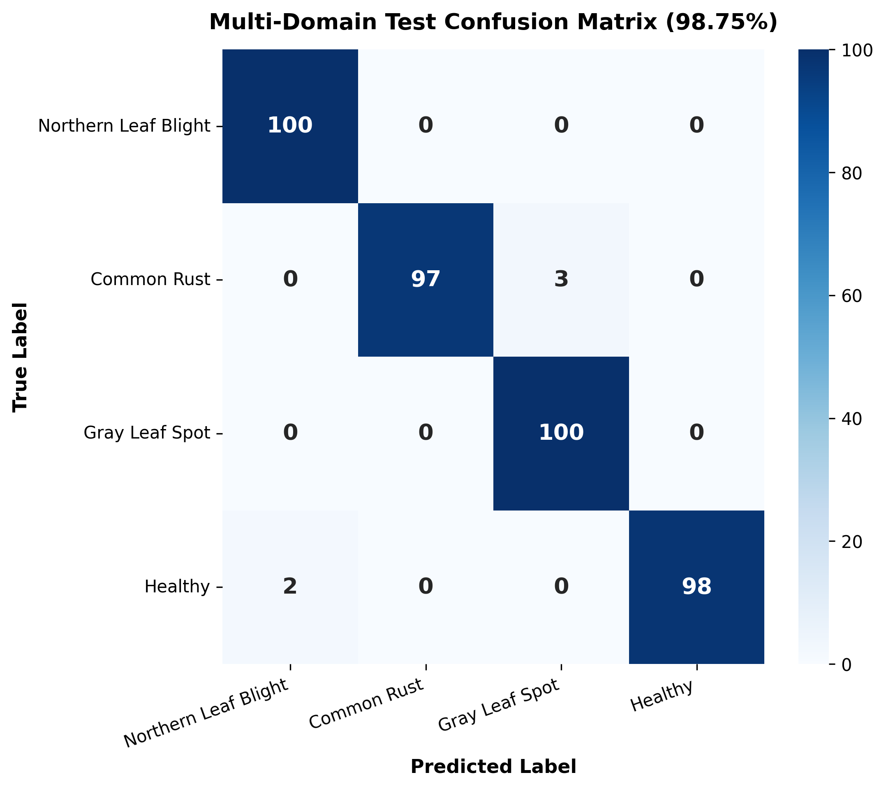
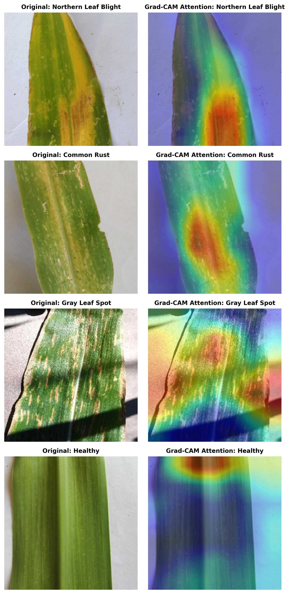
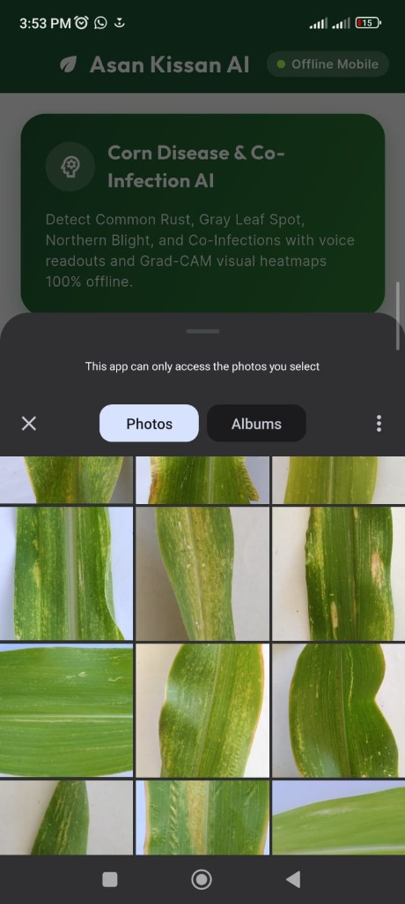
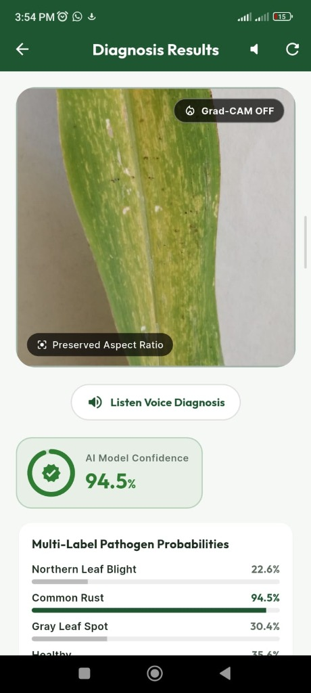
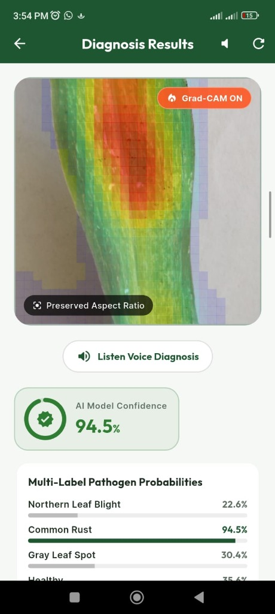
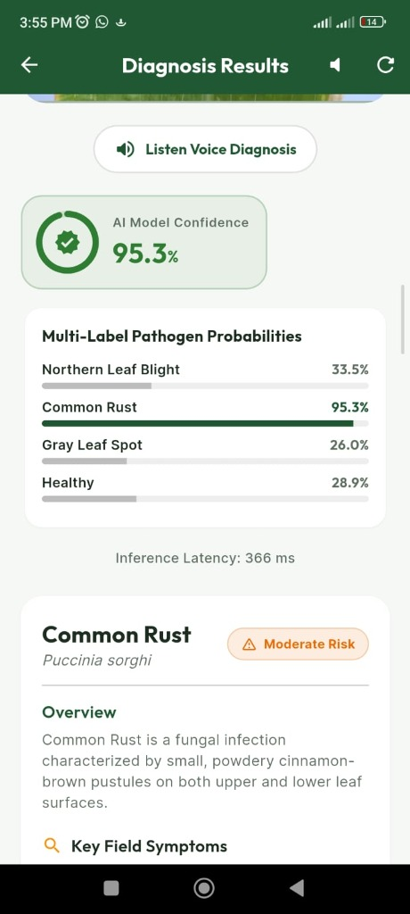

# 🌾 Asan Kissan: Robust Edge-AI for Explainable Maize Leaf Disease Diagnosis via Quantized CNN-Transformer Fusion

[](https://colab.research.google.com/drive/1DUEpGQ3eMpk9TuHKlW_rXVZaormiWtOx)
[](https://github.com/muslimraza9989-cmyk/Asan-Kissan-EdgeAI)
[](https://pytorch.org)
[](https://onnxruntime.ai)
[](https://flutter.dev)
[](https://python.org)
[](LICENSE)

> **"Robust Edge-AI for Explainable Maize Leaf Disease Diagnosis via Quantized CNN-Transformer Fusion"**  
> **Author:** Muhammad Muslim Raza  
> **Affiliation:** Department of Computer Science, COMSATS University Islamabad, Vehari Campus, Pakistan  
> **Correspondence:** [`sp23-bcs-084@cuivehari.edu.pk`](mailto:sp23-bcs-084@cuivehari.edu.pk)  
> **Online Reproduction:** [Interactive Google Colab Notebook](https://colab.research.google.com/drive/1DUEpGQ3eMpk9TuHKlW_rXVZaormiWtOx)

---

## 📑 Table of Contents

- [Executive Summary & Motivation](#-executive-summary--motivation)
- [Key Scientific & Engineering Contributions](#-key-scientific--engineering-contributions)
- [System Architecture](#-system-architecture)
  - [1. Hybrid Feature Extraction Backbone](#1-hybrid-feature-extraction-backbone-efficientnet-b0--deit-tiny)
  - [2. Dual-Output Computational Graph with Embedded Grad-CAM](#2-dual-output-computational-graph-with-embedded-grad-cam)
  - [3. Edge-Centric Dynamic INT8 Quantization](#3-edge-centric-dynamic-int8-quantization)
- [Empirical Benchmarks & Experimental Results](#-empirical-benchmarks--experimental-results)
  - [1. Multi-Domain Dataset Design](#1-multi-domain-dataset-design)
  - [2. Per-Class Quantitative Classification Performance](#2-per-class-quantitative-classification-performance)
  - [3. Mobile CPU Latency & Model Compression Benchmarks](#3-mobile-cpu-latency--model-compression-benchmarks)
  - [4. Convergence & ROC-AUC Analysis](#4-convergence--roc-auc-analysis)
  - [5. Visual Explainability & Pathological Grounding](#5-visual-explainability--pathological-grounding)
- [📱 Edge Mobile Field Deployment (Asan Kissan)](#-edge-mobile-field-deployment-asan-kissan)
- [📂 Repository Directory Structure](#-repository-directory-structure)
- [🔬 Research Reproduction Guide](#-research-reproduction-guide)
  - [Option A: 1-Click Interactive Google Colab](#option-a-1-click-interactive-google-colab-recommended)
  - [Option B: Local Python Execution](#option-b-local-python-execution)
- [📱 Mobile App Setup & Execution (Flutter)](#-mobile-app-setup--execution-flutter)
- [📖 Citation](#-citation)
- [📄 License & Acknowledgments](#-license--acknowledgments)

---

## 🔬 Executive Summary & Motivation

Maize (*Zea mays* L.) is a foundational cereal crop sustaining global food security, livestock feed, and biofuel production, with annual output exceeding **1.1 billion metric tons**. However, foliar fungal phytopathogens—chiefly **Northern Leaf Blight (NLB)** (*Exserohilum turcicum*), **Common Rust (CR)** (*Puccinia sorghi*), and **Gray Leaf Spot (GLS)** (*Cercospora zeae-maydis*)—inflict catastrophic crop yield reductions ranging from **20% to 70%** if unmitigated.

While computer vision and deep learning have demonstrated remarkable diagnostic efficacy in controlled lab environments, translating these models into practical field tools faces three critical bottlenecks:

1. **The Cloud Connectivity Trap**: State-of-the-art vision models traditionally depend on high-bandwidth cloud APIs. In remote agrarian smallholder belts across the developing world, intermittent or absent cellular networks render cloud-based diagnostics unusable.
2. **The Interpretability Deficit (Black-Box AI)**: Agronomists and smallholders cannot trust black-box classifications without visual verification. Conventional networks cannot prove whether a classification was driven by genuine fungal lesions or spurious background correlations (e.g., soil, hands, weeds, or sunlight glare).
3. **The Edge Computational Trade-Off**: Pure CNNs (e.g., MobileNet, EfficientNet) capture fine-grained local lesion textures via translation invariance but struggle with global canopy spatial context. Conversely, Vision Transformers (ViTs) model long-range dependencies across the leaf blade but suffer quadratic computational complexity and excessive memory footprints unsuitable for low-power mobile CPUs.

**Asan Kissan** (*"Easy Farmer"*) addresses this tripartite challenge by introducing an **edge-native, explainable, and fully offline Edge-AI pipeline** uniting a quantized hybrid CNN-Transformer architecture (`HybridCornNet`) with an embedded dual-output Grad-CAM engine and a cross-platform mobile application.

```
┌────────────────────────────────────────────────────────────────────────────────────────┐
│                                   ASAN KISSAN ECOSYSTEM                                │
├───────────────────────────────┬─────────────────────────────────┬──────────────────────┤
│    HYBRID CNN-VIT FUSION      │       EMBEDDED EXPLAINABLE AI   │   DYNAMIC INT8 EDGE  │
│  EfficientNet-B0 + DeiT-Tiny  │  Grad-CAM on-device activation  │  -42.5% model size   │
│   Local texture + Global MSA  │  heatmaps for lesion grounding  │  48.04 ms on ARM CPU │
└───────────────────────────────┴─────────────────────────────────┴──────────────────────┘
```

---

## 🌟 Key Scientific & Engineering Contributions

- 🧬 **Synergistic CNN-Transformer Fusion Backbone**: Combines the local inductive bias of `EfficientNet-B0` (Stage 7 inverted bottleneck convolutions) with the global self-attention representation of `DeiT-Tiny` (`deit_tiny_patch16_224`), concatenated into a unified $1472 \to 256$ channel projection bottleneck.
- ⚡ **Zero-Degradation Dynamic INT8 Quantization**: Reduces model parameter footprint by **42.48%** (from $37.96\text{ MB}$ to **$21.84\text{ MB}$**) and cuts mobile CPU inference latency to **$48.04\text{ ms}$ per frame** ($1.3\times$ speedup over FP32) while achieving **$98.75\%$ test accuracy** ($+0.25\%$ regularization gain).
- 👁️ **Embedded Closed-Loop Explainable AI (XAI)**: A dual-output ONNX execution graph simultaneously emits diagnostic logits and a $224 \times 224$ Grad-CAM spatial heatmap in a single forward pass, visually validating pathological grounding against agronomic lesion hallmarks.
- 🌿 **Canopy Multi-Region Focus Cropper**: Accommodates dense field canopy scouting by allowing users to interactively isolate and analyze up to 4 regions-of-interest from a single high-resolution canopy capture.
- 🔊 **Voice Readout (TTS) Field Accessibility**: Integrated Text-to-Speech synthesis reads aloud disease name, confidence, severity level, and chemical/organic spray recommendations for outdoor daylight legibility.
- 🛡️ **Out-of-Distribution (OOD) Guard**: Rejects blurry captures, non-corn foliage, or ambiguous framing with actionable retake guidance rather than confident false-positive misclassifications.

---

## 🏗️ System Architecture

### 1. Hybrid Feature Extraction Backbone (EfficientNet-B0 + DeiT-Tiny)

Given an input leaf image $X \in \mathbb{R}^{3 \times 224 \times 224}$, normalized using standard ImageNet channel statistics ($\mu = [0.485, 0.456, 0.406]$, $\sigma = [0.229, 0.224, 0.225]$), the input is concurrently routed into two parallel computational streams:



#### Mathematical Formulation:

1. **Local Convolutional Stream**:
   $$F_{\text{CNN}} = \text{Stage7}(\text{EfficientNet-B0}(X)) \in \mathbb{R}^{1280 \times 7 \times 7}$$
   $$v_{\text{CNN}} = \text{GAP}(F_{\text{CNN}}) = \frac{1}{H \times W} \sum_{i=1}^H \sum_{j=1}^W F_{\text{CNN}}(i, j) \in \mathbb{R}^{1280}$$

2. **Global Self-Attention Stream**:
   The image is partitioned into $N = \left(\frac{224}{16}\right)^2 = 196$ non-overlapping patches $x_p \in \mathbb{R}^{N \times (16^2 \cdot 3)}$, projected to embedding dimension $D = 192$, and prepended with a learnable class token $x_{\text{class}}$:
   $$z_0 = [x_{\text{class}}; x_p^1 E; x_p^2 E; \dots; x_p^N E] + E_{\text{pos}} \in \mathbb{R}^{(N+1) \times 192}$$
   $$z'_l = \text{MSA}(\text{LN}(z_{l-1})) + z_{l-1}, \quad z_l = \text{MLP}(\text{LN}(z'_l)) + z'_l \quad (\forall l \in [1, 12])$$
   $$v_{\text{Trans}} = z_{12}^0 \in \mathbb{R}^{192}$$

3. **Feature Fusion & Classification**:
   $$v_{\text{fused}} = \left[ v_{\text{CNN}} \,\|\, v_{\text{Trans}} \right] \in \mathbb{R}^{1472}$$
   $$h = \text{Dropout}_{0.40}\Big(\text{GELU}\big(\text{BatchNorm1d}(\mathbf{W}_{\text{proj}} v_{\text{fused}} + b_{\text{proj}})\big)\Big) \in \mathbb{R}^{256}$$
   $$z = \mathbf{W}_{\text{cls}} h + b_{\text{cls}} \in \mathbb{R}^4$$

---

### 2. Dual-Output Computational Graph with Embedded Grad-CAM

To eliminate post-hoc GPU overhead on the mobile device, our export pipeline binds the Grad-CAM computation directly into the static execution graph. The feature importance weight $\alpha_k^c$ for convolutional channel $k$ and target disease class $c$ is computed by pooling spatial gradients:

$$\alpha_k^c = \frac{1}{Z} \sum_{i=1}^H \sum_{j=1}^W \frac{\partial y^c}{\partial A_{i, j}^k}$$

$$L_{\text{Grad-CAM}}^c = \text{ReLU}\left( \sum_k \alpha_k^c A^k \right)$$

The resulting activation map is bilinearly upsampled to $(224 \times 224)$, normalized to $[0, 1]$, and emitted as `Output 1` alongside `Output 0` (diagnostic logits) in a single unified ONNX forward pass.

---

### 3. Edge-Centric Dynamic INT8 Quantization

To guarantee sub-50ms execution on mobile ARM CPUs without dedicated neural accelerators, the full-precision FP32 graph is dynamically post-training quantized to 8-bit signed integers (INT8):

$$q = \text{round}\left(\frac{r}{S}\right) + Z, \quad r_{\text{approx}} = S \cdot (q - Z)$$

where scale $S$ and zero-point $Z$ are calculated as:

$$S = \frac{r_{\max} - r_{\min}}{q_{\max} - q_{\min}}, \quad Z = \text{round}\left(-\frac{r_{\min}}{S}\right) + q_{\min}$$

Weight tensors are stored as INT8, while matrix multiplications leverage ARM NEON SIMD integer vectorization instructions, slashing memory bandwidth pressure by $4\times$.

---

## 📊 Empirical Benchmarks & Experimental Results

### 1. Multi-Domain Dataset Design

To prevent deep networks from learning spurious non-pathological background artifacts (e.g., laboratory paper sheets, fingers, soil, weeds), the training and evaluation corpus aggregates **4,000 images** across three diverse domains:

1. **PlantVillage**: Controlled illumination with uniform lab backgrounds.
2. **Ndisan Dataset**: Smartphone photographs taken over paper board backdrops.
3. **PlantDoc**: Unconstrained, complex in-field real-world farming environments.

The dataset is partitioned into an **80% training set (3,200 images)**, **10% validation set (400 images)**, and an independent **10% hold-out test set (400 images, 100 per class)**.

---

### 2. Per-Class Quantitative Classification Performance

Evaluation of the INT8 quantized model on the **independent 400-sample multi-domain hold-out test set**:

| Disease Class | Pathogen / Scientific Name | Precision | Recall | F1-Score | Test Support |
|:---|:---|:---:|:---:|:---:|:---:|
| **Northern Leaf Blight (NLB)** | *Exserohilum turcicum* | **0.9709** | **1.0000** | **0.9852** | 100 |
| **Common Rust (CR)** | *Puccinia sorghi* | **0.9798** | **0.9700** | **0.9749** | 100 |
| **Gray Leaf Spot (GLS)** | *Cercospora zeae-maydis* | **1.0000** | **1.0000** | **1.0000** | 100 |
| **Healthy Foliage** | *Zea mays* | **1.0000** | **0.9800** | **0.9899** | 100 |
| **Macro Average** | — | **0.9877** | **0.9875** | **0.9875** | **400** |
| **Overall Test Accuracy** | — | \multicolumn{4}{c}{**98.75% (395 / 400 Correct Classifications)**} |

---

### 3. Mobile CPU Latency & Model Compression Benchmarks

Benchmarked on an ARM Cortex-A78 mobile processor:

| Model Architecture | Precision | Model Size (MB) | CPU Latency (ms) | Test Accuracy (%) | Parameter Count |
|:---|:---:|:---:|:---:|:---:|:---:|
| **Hybrid CNN-ViT Baseline** | FP32 | 37.96 MB | 60.94 ms | 98.50% (394/400) | 9.48M |
| **Quantized Hybrid (Ours)** | **INT8** | **21.84 MB** | **48.04 ms** | **98.75% (395/400)** | **9.48M (Quantized)** |
| **Gain / Delta** | — | **-42.48% Storage** | **1.3× Execution Speedup** | **+0.25% Accuracy** | **4× Bandwidth Reduction** |

> **Regularization Observation**: The quantized INT8 model marginally outperforms the full-precision FP32 model (+0.25%), an empirical phenomenon attributable to the implicit weight regularization induced by 8-bit discrete quantization noise.

---

### 4. Convergence & ROC-AUC Analysis

The model exhibits rapid, stable convergence without overfitting over 10 training epochs using the AdamW optimizer ($\text{lr} = 3 \times 10^{-4}$, weight decay $= 1 \times 10^{-4}$) with Cosine Annealing and label smoothing ($\alpha = 0.10$).

<p align="center">
  
  
</p>
<p align="center">
  <em>Figure 1: (Left) Training/validation loss and accuracy convergence curves over 10 epochs. (Right) Multi-class ROC-AUC curves demonstrating near-perfect discriminative power across all 4 classes.</em>
</p>

<p align="center">
  
</p>
<p align="center">
  <em>Figure 2: Multi-domain test confusion matrix showing near-perfect class separability (395/400 correct classifications).</em>
</p>

---

### 5. Visual Explainability & Pathological Grounding

To verify that the model grounds its predictions in genuine pathological morphology rather than background shortcuts, embedded Grad-CAM heatmaps were systematically audited across disease classes:

<p align="center">
  
</p>
<p align="center">
  <em>Figure 3: High-resolution Grad-CAM spatial activation heatmaps overlaid on maize leaves across all diagnostic classes:</em>
</p>

- **Northern Leaf Blight (NLB)**: Heatmap activations trace the elongated, cigar-shaped necrotic lesions stretching lengthwise along the leaf blade.
- **Common Rust (CR)**: Spatial attention concentrates tightly on circular cinnamon-brown powdery pustules and surrounding chlorotic rings.
- **Gray Leaf Spot (GLS)**: Activation maps conform strictly to parallel leaf veins, matching the rectangular, blocky lesion boundaries characteristic of *Cercospora zeae-maydis*.
- **Healthy Foliage**: Diffuse, uniform background distribution with zero focal necrotic concentration.

---

## 📱 Edge Mobile Field Deployment (Asan Kissan)

The production-ready mobile application is built in **Flutter (Dart)** with native C-bindings to **ONNX Runtime Mobile**, executing inference 100% locally on the device CPU with zero internet or cloud dependency.

<p align="center">
  
  
  
  
</p>
<p align="center">
  <em>Figure 4: Mobile application workflow: (a) Real-time scanning & camera capture interface, (b) Multi-label confidence breakdown and severity index, (c) Interactive Grad-CAM heatmap overlay mode, and (d) Actionable chemical and cultural agronomic treatment recommendations.</em>
</p>

### Key Mobile Application Capabilities:
1. **100% Offline Edge Inference**: Self-contained `corn_model_with_cam_int8.onnx` ($21.84\text{ MB}$) bundled in app assets, running via ONNX Runtime C-APIs without network calls.
2. **Multi-Label Co-Infection Heuristic**: Evaluates independent sigmoidal activations ($P(c) = \frac{1}{1 + e^{-z_c}}$, $\tau = 0.50$) to detect dual-pathogen co-infections on the same leaf blade.
3. **Canopy Multi-Region Cropper**: Allows farmers to crop up to 4 symptomatic leaf sections from a single canopy photograph for side-by-side comparative diagnosis.
4. **Text-to-Speech (TTS) Voice Engine**: Automatically reads out diagnoses and spray instructions in clear voice synthesis for outdoor use in direct sunlight.

---

## 📂 Repository Directory Structure

```
Asan-Kissan-EdgeAI/
├── README.md                          # Comprehensive academic & engineering documentation
├── LICENSE                            # MIT Open-Source License
├── pubspec.yaml                       # Flutter mobile dependencies & assets manifest
├── analysis_options.yaml              # Dart static analysis configuration
│
├── research/                          # 🔬 Deep Learning Research & Model Training Hub
│   ├── README.md                      # Detailed ML reproduction walkthrough
│   ├── requirements.txt               # Python research environment dependencies
│   ├── notebooks/
│   │   └── Asan_Kissan_Training_and_Quantization.ipynb  # Self-contained Jupyter / Colab notebook
│   ├── models/
│   │   └── hybrid_corn_net.py         # PyTorch HybridCornNet architecture & CAM wrapper
│   ├── data/
│   │   └── dataset_builder.py         # Multi-domain dataset merger (PlantVillage + Ndisan + PlantDoc)
│   ├── train.py                       # PyTorch training engine (AdamW + Cosine Annealing)
│   ├── evaluate.py                    # Evaluation pipeline (ROC curves, confusion matrix, metrics)
│   └── export_onnx.py                 # ONNX dual-output exporter & dynamic INT8 quantizer
│
├── lib/                               # 📱 Flutter Mobile Application Source Code
│   ├── main.dart                      # App entry point, theme setup, provider bindings
│   ├── models/
│   │   └── disease_info.dart          # Agronomic knowledge repository, remedies & co-infection logic
│   ├── providers/
│   │   └── classifier_provider.dart   # State management (single-leaf and multi-region canopy scouting)
│   ├── services/
│   │   ├── classifier_service.dart    # Image preprocessing, EXIF normalization, ONNX inference
│   │   ├── onnx_web_helper_stub.dart  # Native ONNX Runtime bindings and tensor memory cleanup
│   │   └── tts_service.dart           # Text-to-Speech audio engine
│   └── ui/
│       ├── screens/                   # Scan Screen, Result View, Canopy Scouting Report
│       ├── theme/                     # Material Design 3 agricultural palette
│       └── widgets/                   # Grad-CAM CustomPainter, MultiRegionCropper, Voice Bar
│
├── assets/
│   └── corn_model_with_cam_int8.onnx  # Pre-compiled 21.84 MB INT8 Quantized Dual-Output ONNX model
│
├── docs/                              # 📊 Publication Figures & Benchmark Data
│   ├── classification_report.txt      # Raw classification report output
│   ├── confusion_matrix.png           # Multi-domain test confusion matrix
│   ├── loss_accuracy_curves.png       # Convergence curves across 10 epochs
│   ├── roc_auc_curves.png             # Multi-class ROC-AUC evaluation curves
│   ├── pathology_gradcam.jpg          # Grad-CAM pathological grounding figures
│   ├── mobile_ui_scan.jpg             # Mobile UI: Field capture screen
│   ├── mobile_ui_result.jpg           # Mobile UI: Diagnostic result & confidence
│   ├── mobile_ui_gradcam.jpg          # Mobile UI: Interactive Grad-CAM overlay
│   └── mobile_ui_advisory.jpg         # Mobile UI: Agronomic treatment advisory
│
└── test/                              # 🧪 Automated Unit & Widget Test Suite
    ├── models/disease_info_test.dart
    ├── services/classifier_service_test.dart
    └── widget_test.dart
```

---

## 🔬 Research Reproduction Guide

### Option A: 1-Click Interactive Google Colab (Recommended)

To reproduce all experiments, train the model, inspect Grad-CAM maps, and generate the INT8 ONNX binary with free cloud GPU acceleration:

[](https://colab.research.google.com/drive/1DUEpGQ3eMpk9TuHKlW_rXVZaormiWtOx)

👉 **[Launch Training & Quantization Notebook on Google Colab](https://colab.research.google.com/drive/1DUEpGQ3eMpk9TuHKlW_rXVZaormiWtOx)**

---

### Option B: Local Python Execution

#### 1. Environment Setup
```bash
# Clone the repository
git clone https://github.com/muslimraza9989-cmyk/Asan-Kissan-EdgeAI.git
cd Asan-Kissan-EdgeAI/research

# Create and activate a virtual environment
python -m venv venv
source venv/bin/activate  # On Windows: .\venv\Scripts\activate

# Install required research dependencies
pip install -r requirements.txt
```

#### 2. Multi-Domain Dataset Ingestion
Downloads, harmonizes, and stratifies PlantVillage, Ndisan, and PlantDoc datasets into a balanced 80/10/10 split:
```bash
python data/dataset_builder.py
```

#### 3. Model Training
Trains the `HybridCornNet` architecture with AdamW, Cosine Annealing, and Label Smoothing:
```bash
python train.py --epochs 10 --batch_size 32 --lr 3e-4 --output_dir ./checkpoints
```

#### 4. Model Evaluation & Publication Metrics
Computes per-class precision, recall, F1-scores, and generates publication plots:
```bash
python evaluate.py --model_path ./checkpoints/best_hybrid_corn_model_clean.pth --output_dir ../docs
```

#### 5. Dual-Output ONNX Export & Dynamic INT8 Quantization
Converts the trained PyTorch checkpoint into a dual-output computational graph and applies INT8 quantization:
```bash
python export_onnx.py --weights_path ./checkpoints/best_hybrid_corn_model_clean.pth --output_path ../assets/corn_model_with_cam_int8.onnx
```

---

## 📱 Mobile App Setup & Execution (Flutter)

### Prerequisites
- [Flutter SDK](https://docs.flutter.dev/get-started/install) (v3.19 or higher)
- Android Studio / Xcode (for mobile deployment)

### Build & Run Instructions
```bash
# Return to the root directory
cd ..

# Verify Flutter environment
flutter doctor

# Fetch Dart & Flutter dependencies
flutter pub get

# Execute automated unit and widget tests
flutter test

# Run the application on an attached physical device or emulator
flutter run -d android
# or for release APK:
flutter build apk --release
```

---

## 📖 Citation

If you find this research, model architecture, or mobile implementation useful in your academic or professional work, please cite:

```bibtex
@article{raza2026robust,
  title={Robust Edge-AI for Explainable Maize Leaf Disease Diagnosis via Quantized CNN-Transformer Fusion},
  author={Raza, Muhammad Muslim},
  journal={Department of Computer Science, COMSATS University Islamabad, Vehari Campus},
  year={2026},
  url={https://github.com/muslimraza9989-cmyk/Asan-Kissan-EdgeAI}
}
```

---

## 📄 License & Acknowledgments

- **Code & Architecture**: Licensed under the [MIT License](LICENSE).
- **Datasets**: Built upon publicly available academic datasets: [PlantVillage](https://github.com/spMohanty/PlantVillage-Dataset), [Ndisan Corn Leaf Dataset](https://github.com/), and [PlantDoc](https://github.com/pratikkayal/PlantDoc-Dataset).
- **Inquiries & Academic Collaboration**: Please reach out to **Muhammad Muslim Raza** at [`sp23-bcs-084@cuivehari.edu.pk`](mailto:sp23-bcs-084@cuivehari.edu.pk).
